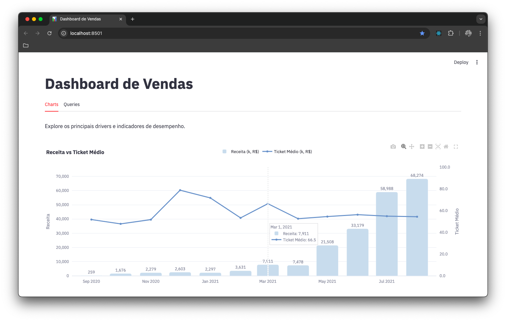
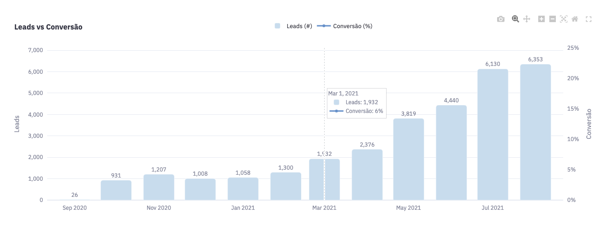
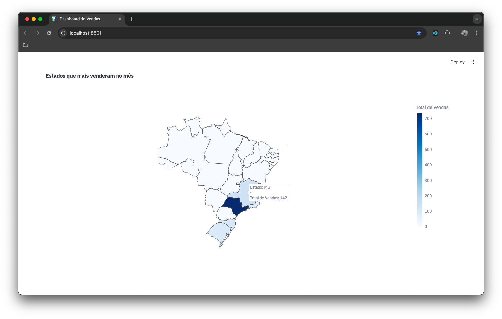
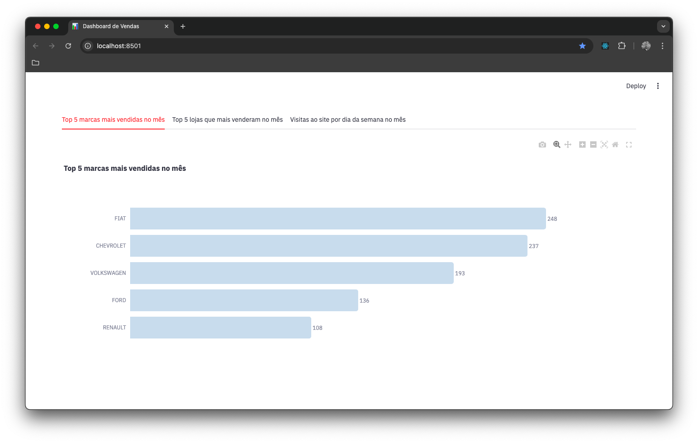
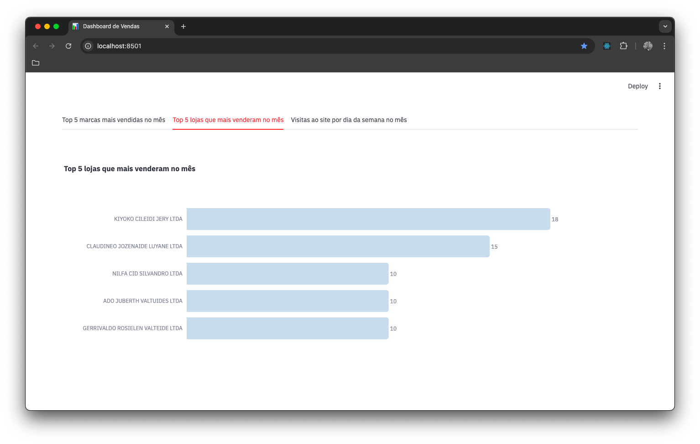
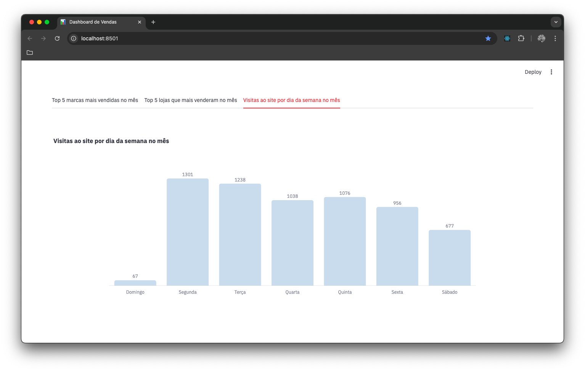
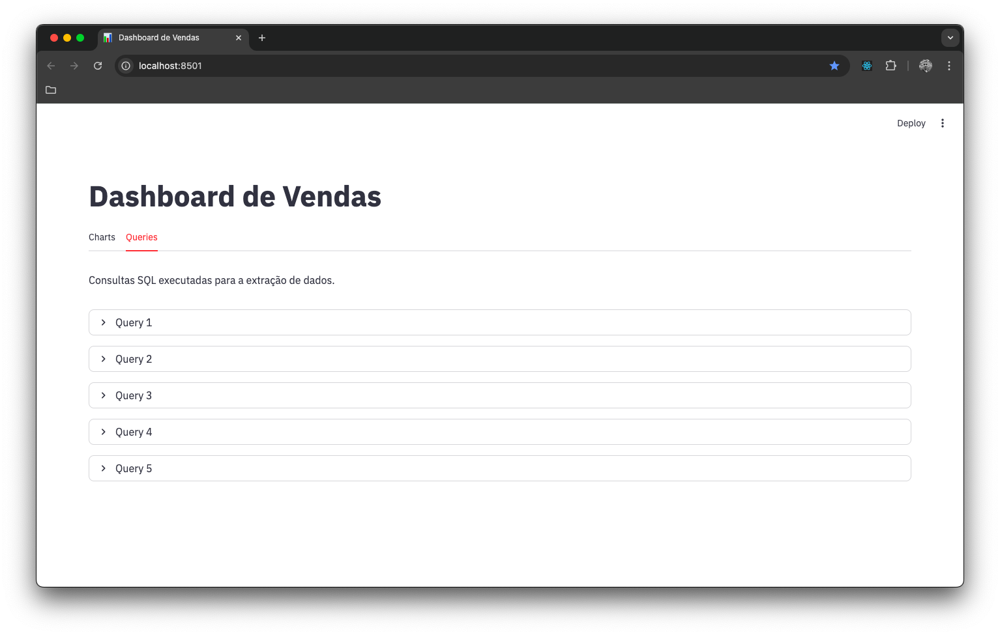
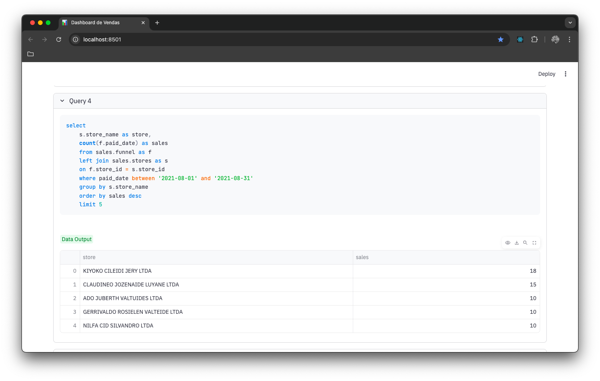

# Dashboard de Vendas

#### Explore os principais drivers e indicadores de desempenho.

---

## Links Importantes do Tutorial

| Recurso  | Link                                                        |
| -------- | ----------------------------------------------------------- |
| LinkedIn | [wildermiranda](https://www.linkedin.com/in/wildermiranda/) |

---
## Sobre o Projeto

Este repositório apresenta análise de dados focado no setor automotivo, usando PostgreSQL para a estruturação de queries e Streamlit para a visualização de indicadores de vendas.

Pipeline:

1. Consultas SQL executadas para a extração de dados
2. Validações e agregações para análise
3. Visualização no Streamlit

Objetivo: Desenvolver uma solução completa de dados, desde a extração e manipulação com SQL até a visualização interativa no Streamlit.

---
## Dashboard 📊
### Visão Geral


### Leads vs Conversão



### Estados que mais venderam no mês


### Top 5 marcas mais vendidas no mês


### Top 5 lojas que mais venderam no mês


### Visitas ao site por dia da semana no mês


### Consultas SQL execultadas para a extração de dados.




---
## Stack Tecnológica

| Camada            | Tecnologia | Versão | Por que usamos                                                                                                       |
| ----------------- | ---------- | ------ | -------------------------------------------------------------------------------------------------------------------- |
| Core              | Python     | 3.14+  | Linguagem de programação de **alto nível** e multiparadigma, usada como o motor lógico da aplicação.                 |
| Core              | Streamlit  | 1.56+  | Framework para a **implantação (deployment) de web apps** de dados, focado na criação de interfaces de usuário (UI). |
| Biblioteca Python | Pandas     | 3.0+   | **Análise e manipulação de dados** estruturados através de DataFrames.                                               |
| Biblioteca Python | Plotly     | 6.7+   | Biblioteca de **computação gráfica interativa** para a renderização de visualizações de dados complexas.             |
| Ferramenta        | UV         | -      | Gerencia dependências e execução do projeto de forma rápida e reprodutível.                                          |

---
## Pré-requisitos

- Python 3.14 ou superior
- UV instalado

Instalação do UV (se necessário):

```bash
pip install uv
```

---
## Instalação e Configuração

### 1) Clone o repositório

```bash
git clone https://github.com/wildermiranda/SalesDashboard.git
cd SalesDashboard
```

### 2) Sincronize dependências

```bash
uv sync
```

---
## Como Executar

### Executar dashboard Streamlit

```bash
uv run streamlit run app.py
```

O dashboard será aberto no navegador local.

---
## Contato

Wilder Miranda | contatowildermiranda@gmail.com

[](https://www.linkedin.com/in/wildermiranda/)

---

<div align="center">
**Dê uma star no repositório ⭐ **
</div>

<div align="center">
**Feito com por [@wildermiranda](https://www.linkedin.com/in/wildermiranda/)**
</div>
